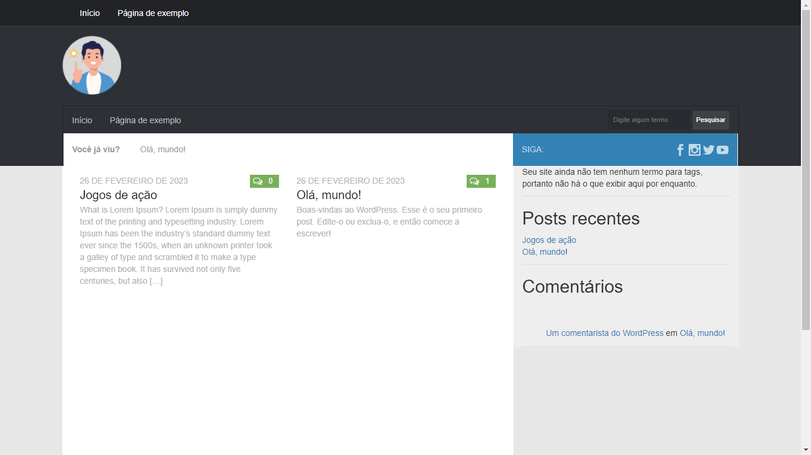

<h1 align="center"> Plugin de receita </h1>

Este plugin foi criado para o usuário transformar o seu site Wordpress em um livro de receitas....

  <a href="#-tecnologias">Tecnologias</a>&nbsp;&nbsp;&nbsp;|&nbsp;&nbsp;&nbsp;
  <a href="#-projeto">Projeto</a>&nbsp;&nbsp;&nbsp;|&nbsp;&nbsp;&nbsp;
  <a href="#-layout">Layout</a>&nbsp;&nbsp;&nbsp;|&nbsp;&nbsp;&nbsp;
  <a href="#memo-licença">Licença</a>

  

 

  <!---->

## 🚀 Tecnologias

Esse projeto foi desenvolvido com as seguintes tecnologias:

- PHP;
- HTML;
- CSS;
- JavaScript;
- Sass;
- Wordpress;
- Bootstrap versão 3.3.7;
- Git e Github.

## 💻 Projeto

Este plugin foi criado para o usuário transformar o seu site em um livro de receitas, onde
O cliente pode criar, editar, atualizar e deletar com facilidade com uma interfaçe intuitiva e animada

## :memo: Licença

Esse projeto está sob a licença MIT.

---

Feito com ♥ by Vanderlei

# Plugin de receitas
